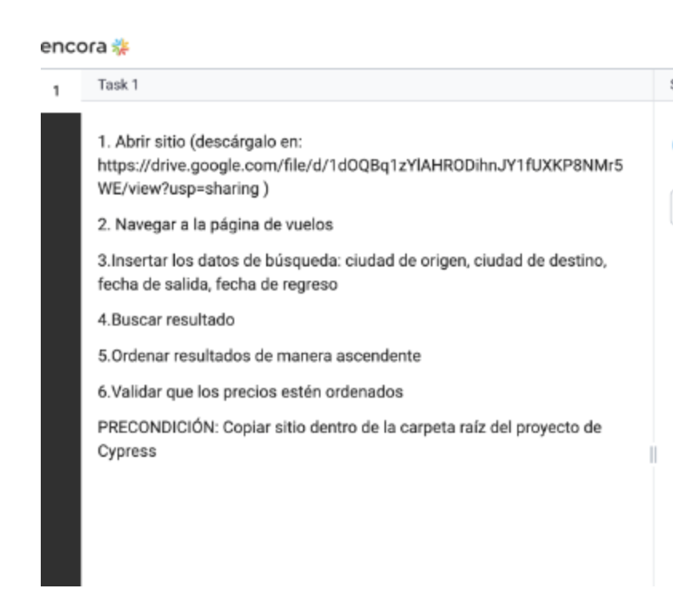
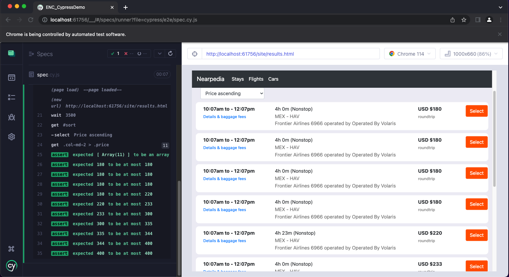

# Cypress Demo Test
This is a Test Demo in Cypress Javascript. Follow the instructions below to execute the Cypress test locally. Do this after clioning the repo.

## Test Case Instructions


## Install Dependencies
Navigate to project directory and install all node dependencies
```bash
npm install
```
## Run Cypress Test
To run the test, enter the following command inside the current project
```bash
npx cypress open
```
## Test Results

